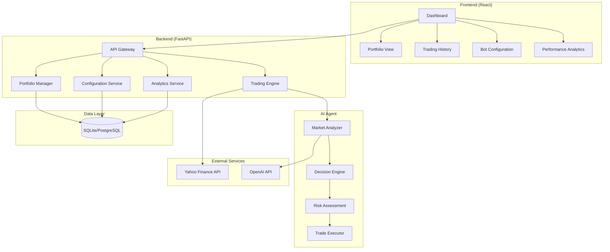
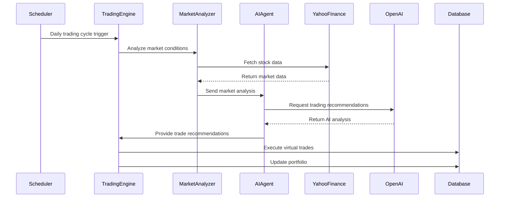

# StockBot Architecture Plan

## Project Overview
A web-based AI-powered stock trading bot that uses predictive analytics to make automated trading decisions with virtual money, designed for future real money integration.

## Technology Stack

### Backend
- **Framework**: FastAPI (Python)
- **Database**: SQLite (development) → PostgreSQL (production)
- **AI/ML**: OpenAI GPT-4 API for trading decisions
- **Stock Data**: Yahoo Finance API (yfinance library)
- **Task Scheduling**: APScheduler for daily trading cycles
- **Environment**: Python 3.9+ with virtual environment

### Frontend
- **Framework**: React 18 with TypeScript
- **State Management**: React Context API / Redux Toolkit
- **UI Library**: Material-UI or Tailwind CSS
- **Charts**: Chart.js or Recharts for data visualization
- **HTTP Client**: Axios for API communication

### Development Tools
- **API Documentation**: FastAPI automatic OpenAPI/Swagger
- **Testing**: pytest (backend), Jest (frontend)
- **Code Quality**: Black, flake8 (Python), ESLint (TypeScript)

## System Architecture

## Database Schema

### Tables

#### `portfolio`
- `id` (Primary Key)
- `cash_balance` (Decimal) - Current available cash
- `total_value` (Decimal) - Total portfolio value
- `created_at` (DateTime)
- `updated_at` (DateTime)

#### `holdings`
- `id` (Primary Key)
- `symbol` (String) - Stock ticker symbol
- `quantity` (Integer) - Number of shares owned
- `average_cost` (Decimal) - Average cost per share
- `current_price` (Decimal) - Latest stock price
- `created_at` (DateTime)
- `updated_at` (DateTime)

#### `trades`
- `id` (Primary Key)
- `symbol` (String) - Stock ticker symbol
- `action` (Enum: BUY/SELL)
- `quantity` (Integer) - Number of shares
- `price` (Decimal) - Price per share
- `total_amount` (Decimal) - Total trade value
- `ai_reasoning` (Text) - AI's decision reasoning
- `executed_at` (DateTime)

#### `bot_config`
- `id` (Primary Key)
- `max_daily_trades` (Integer) - Maximum trades per day
- `max_position_size` (Decimal) - Maximum % of portfolio per stock
- `risk_tolerance` (Enum: LOW/MEDIUM/HIGH)
- `trading_hours_start` (Time)
- `trading_hours_end` (Time)
- `is_active` (Boolean) - Bot enabled/disabled
- `updated_at` (DateTime)

#### `market_data`
- `id` (Primary Key)
- `symbol` (String)
- `price` (Decimal)
- `volume` (Integer)
- `change_percent` (Decimal)
- `timestamp` (DateTime)

## AI Trading Agent Architecture

### Market Analyzer
- Fetches real-time stock data from Yahoo Finance
- Analyzes market trends, volume, and price movements
- Identifies potential trading opportunities
- Generates market sentiment analysis

### Decision Engine (OpenAI Integration)
- Processes market data and historical performance
- Uses GPT-4 to analyze stock fundamentals and technical indicators
- Considers news sentiment and market conditions
- Generates buy/sell recommendations with confidence scores

### Risk Assessment
- Evaluates portfolio diversification
- Checks position sizing limits
- Assesses market volatility
- Implements stop-loss and take-profit logic

### Trade Executor
- Validates trade decisions against configured parameters
- Simulates trade execution with virtual money
- Updates portfolio and holdings
- Logs all trading activities

## API Endpoints

### Portfolio Management
- `GET /api/portfolio` - Get current portfolio status
- `GET /api/holdings` - Get all current stock holdings
- `GET /api/trades` - Get trading history with pagination

### Bot Configuration
- `GET /api/config` - Get current bot configuration
- `PUT /api/config` - Update bot configuration
- `POST /api/bot/start` - Start the trading bot
- `POST /api/bot/stop` - Stop the trading bot

### Market Data
- `GET /api/stocks/{symbol}` - Get current stock data
- `GET /api/stocks/{symbol}/history` - Get historical stock data
- `GET /api/market/trending` - Get trending stocks

### Analytics
- `GET /api/analytics/performance` - Get portfolio performance metrics
- `GET /api/analytics/trades` - Get trade analysis and statistics

## Trading Logic Flow

## Configuration Parameters

### Adjustable Bot Settings
- **Max Daily Trades**: Limit number of trades per day (default: 5)
- **Max Position Size**: Maximum percentage of portfolio per stock (default: 20%)
- **Risk Tolerance**: Conservative/Moderate/Aggressive trading style
- **Trading Window**: Active trading hours (default: 9:30 AM - 4:00 PM EST)
- **Minimum Cash Reserve**: Always keep minimum cash available (default: $5)
- **Stop Loss Percentage**: Automatic sell trigger (default: -10%)
- **Take Profit Percentage**: Automatic sell trigger (default: +15%)

## Security Considerations

### API Key Management
- Store OpenAI API key in environment variables
- Use secure configuration management
- Implement API rate limiting
- Add request authentication for sensitive endpoints

### Data Protection
- Encrypt sensitive configuration data
- Implement proper session management
- Add CORS protection for frontend
- Use HTTPS in production

## Future Real Money Integration

### Preparation Steps
- Abstract trading interface for easy broker integration
- Implement comprehensive logging and audit trails
- Add multi-factor authentication
- Create backup and recovery procedures
- Implement real-time monitoring and alerts

### Broker Integration Options
- Alpaca API (commission-free trading)
- Interactive Brokers API
- TD Ameritrade API
- E*TRADE API

## Development Phases

### Phase 1: Core Infrastructure
- Set up project structure and development environment
- Implement basic FastAPI backend with database
- Create React frontend with basic UI components
- Integrate Yahoo Finance API for stock data

### Phase 2: AI Trading Engine
- Implement OpenAI integration for trading decisions
- Build market analysis and decision-making logic
- Create virtual trading system with $20 starting balance
- Add basic portfolio management

### Phase 3: Web Interface
- Build comprehensive React dashboard
- Implement real-time portfolio tracking
- Add configuration interface for bot parameters
- Create trading history and analytics views

### Phase 4: Advanced Features
- Implement automated daily trading cycles
- Add advanced risk management features
- Create comprehensive logging and monitoring
- Prepare for real money trading integration

## Performance Monitoring

### Key Metrics
- Total portfolio value over time
- Win/loss ratio of trades
- Average holding period
- Risk-adjusted returns
- AI decision accuracy

### Logging Strategy
- All trading decisions with AI reasoning
- API call performance and errors
- Portfolio value changes
- Configuration changes
- System health metrics

This architecture provides a solid foundation for building a sophisticated AI-powered stock trading bot that can start with virtual money and evolve into a real money trading system.